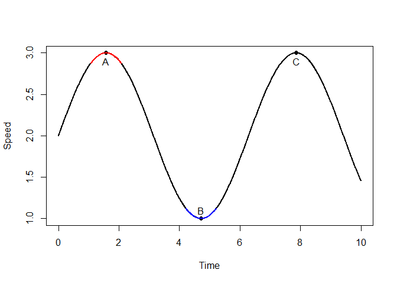

Grab AI For SEA - Safety
========================

This repository is created for the submission for the Grab AI For SEA
Challenge
(<a href="https://www.aiforsea.com/" class="uri">https://www.aiforsea.com/</a>).

As part of the challenge, I have signed up for the question under the
theme of Safety. I have used the R programming language in this
challenge.

The scripts used in this project, including the one used for generating
this document can be found in the folder “Working Code”. This document
is generated by the R Markdown file “Working
Code/Output/Documentation/Grab AI For SEA.Rmd”.

The Data
========

The data provided is made up of: 1. Telematics Data 2. Label of
Dangerous Driving

The telematics data has a total number of 16135561 rows and 11 columns,
split into 10 csv files.

The following is the description as obtained from the website of the
competition (www.aiforsea.com/safety)

<table>
<thead>
<tr class="header">
<th style="text-align: left;">Field</th>
<th style="text-align: left;">Description</th>
</tr>
</thead>
<tbody>
<tr class="odd">
<td style="text-align: left;">bookingID</td>
<td style="text-align: left;">trip id</td>
</tr>
<tr class="even">
<td style="text-align: left;">Accuracy</td>
<td style="text-align: left;">accuracy inferred by GPS in meters</td>
</tr>
<tr class="odd">
<td style="text-align: left;">Bearing</td>
<td style="text-align: left;">GPS bearing in degree</td>
</tr>
<tr class="even">
<td style="text-align: left;">acceleration_x</td>
<td style="text-align: left;">accelerometer reading at x axis (m/s2)</td>
</tr>
<tr class="odd">
<td style="text-align: left;">acceleration_y</td>
<td style="text-align: left;">accelerometer reading at y axis (m/s2)</td>
</tr>
<tr class="even">
<td style="text-align: left;">acceleration_z</td>
<td style="text-align: left;">accelerometer reading at z axis (m/s2)</td>
</tr>
<tr class="odd">
<td style="text-align: left;">gyro_x</td>
<td style="text-align: left;">gyroscrope reading in x axis (rad/s)</td>
</tr>
<tr class="even">
<td style="text-align: left;">gyro_y</td>
<td style="text-align: left;">gyroscope reading in y axis (rad/s)</td>
</tr>
<tr class="odd">
<td style="text-align: left;">gyro_z</td>
<td style="text-align: left;">gyroscope reading in z axis (rad/s)</td>
</tr>
<tr class="even">
<td style="text-align: left;">second</td>
<td style="text-align: left;">time of the record by number of seconds</td>
</tr>
<tr class="odd">
<td style="text-align: left;">Speed</td>
<td style="text-align: left;">speed measured by GPS in m/s</td>
</tr>
</tbody>
</table>

The label of dangerous driving records in binary form of whether a trip
is considered dangerous, 1 if yes and 0 otherwise.

Note that there are some of the bookings with multiple labels. In such
instances, I have classified the particular booking as dangerous driving
if there is at least ONE label of 1.

Feature Engineering
===================

Based on the fields in the telematics data, feature engineering has to
be conducted in order to obtain aggregate features that are meaningful
in determining the riskiness in a particular booking.

Key Concepts Applied
--------------------

At the first sight, while it is tempting to just aggregate the numbers
in the telematics data as they are, it can be highly unintuitive.

The reason is because the car may be accelerating, decelerating or
stopping. Using any measures of central tendency may cause the number to
cancel itself out, between the stages of accelerating and decelerating.

Shown below is a simple illustration of how speed fluctuates during a
trip. For the purpose of simulation, I have used a sine curve.

From the plot above, point A is a local maximum, where the driver
reaches a maximum speed, compared to the instances right before and
after that point. Whereas point B is the local minimum.

From a local maximum point such as point A, the speed right before and
after it will be very informative. It helps us answer questions such as,
did the driver accelerate excessively before suddenly braking? Similar,
information around point B helps us understand if the driver suddenly
decelerated the car, reaching the local minimum, then speed up in a
short matter of time?

\[Lead 1 through 3, Lag 1 through 3, Local Min, Local Max, Stop\]

Some Visualizations
-------------------

Model Training
==============

Based on the features, I have trained a model using the XGB algorithm.

Parameter Tuning
----------------

In order to get the optimal results, some parameters for the algorithm
have to be tuned. This is done by using cross-validation.

As a Grid Search will be very time and memory consuming, I have opted to
tune the parameters one at a time, while keeping the other parameters at
their default values.

### Learning Parameters

The parameters which I have tuned are:

eta: \[What is eta?\]

maximum\_depth

subsample

colsaple\_by\_tree

As we can see from the plots above, even when using the same algorithm,
the parameters can have a significant effect on the model training.

### Number of Features

### Number of Rounds

Another obvious thing is that after a certain number of iterations, the
performance may actually deteriorate. Therefore, the number of
iterations in model training has to be tuned as well. \[after having the
parameters tuned\] The results are shown in the plot below.

\[plot for iteration\]

Results
=======

\[AUC Plot, Figure\] \[How to use the model?\]
