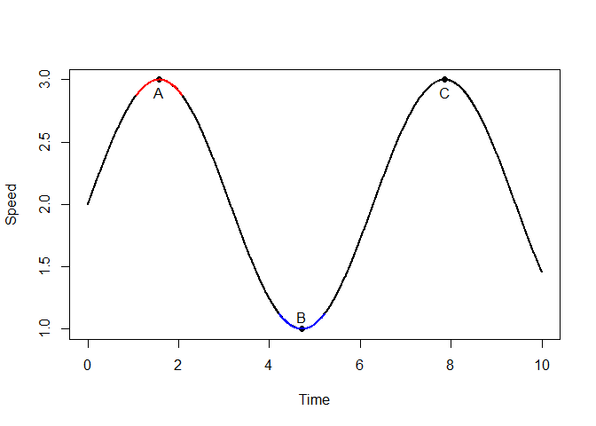
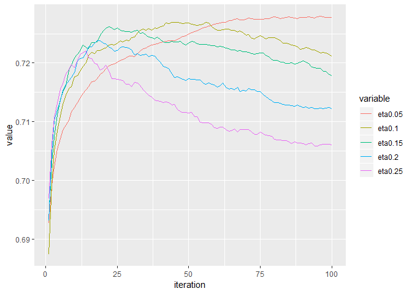
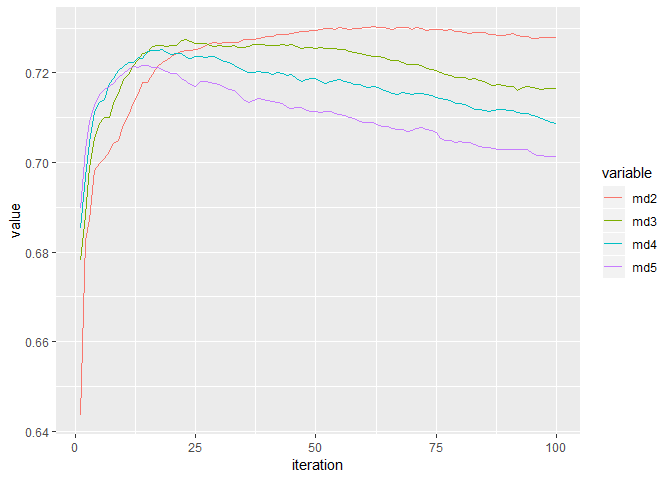
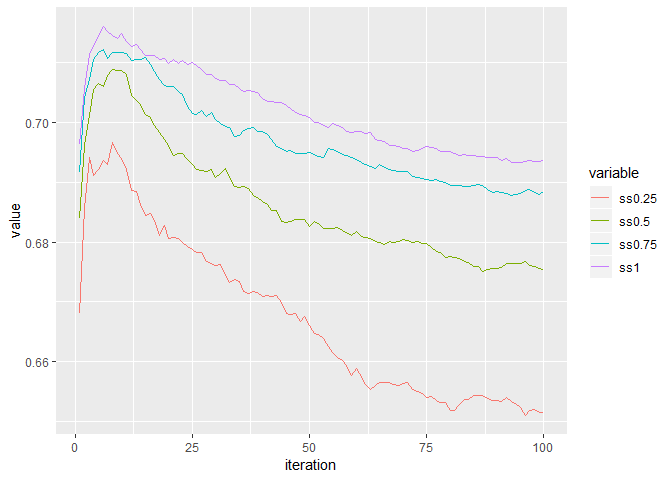
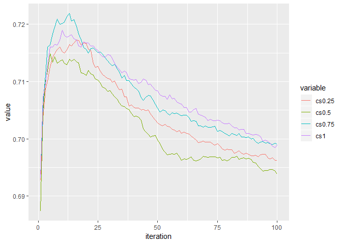
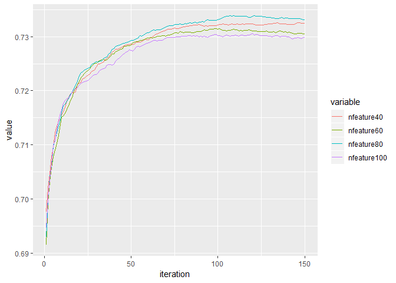
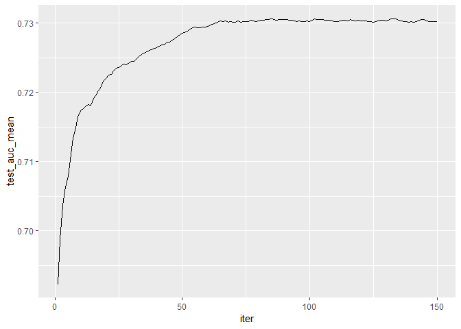
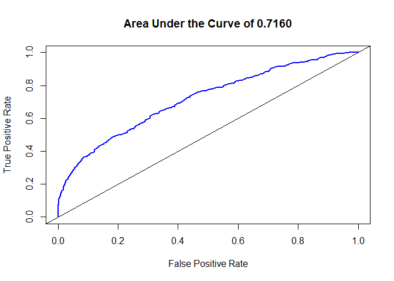

Grab AI For SEA - Safety
========================

This repository is created for the submission for the Grab AI For SEA
Challenge
(<a href="https://www.aiforsea.com/" class="uri">https://www.aiforsea.com/</a>).

As part of the challenge, I have signed up for the question under the
theme of Safety. I have used the R programming language in this
challenge.

The scripts used in this project, including the one used for generating
this document can be found in the folder “Working Code”. This document
is generated by the R Markdown file “Working
Code/Output/Documentation/Grab AI For SEA.Rmd”.

The Data
========

The data provided is made up of: 1. Telematics Data 2. Label of
Dangerous Driving

The telematics data has a total number of 16135561 rows and 11 columns,
split into 10 csv files.

The following is the description as obtained from the website of the
competition (www.aiforsea.com/safety)

<table>
<thead>
<tr class="header">
<th style="text-align: left;">Field</th>
<th style="text-align: left;">Description</th>
</tr>
</thead>
<tbody>
<tr class="odd">
<td style="text-align: left;">bookingID</td>
<td style="text-align: left;">trip id</td>
</tr>
<tr class="even">
<td style="text-align: left;">Accuracy</td>
<td style="text-align: left;">accuracy inferred by GPS in meters</td>
</tr>
<tr class="odd">
<td style="text-align: left;">Bearing</td>
<td style="text-align: left;">GPS bearing in degree</td>
</tr>
<tr class="even">
<td style="text-align: left;">acceleration_x</td>
<td style="text-align: left;">accelerometer reading at x axis (m/s2)</td>
</tr>
<tr class="odd">
<td style="text-align: left;">acceleration_y</td>
<td style="text-align: left;">accelerometer reading at y axis (m/s2)</td>
</tr>
<tr class="even">
<td style="text-align: left;">acceleration_z</td>
<td style="text-align: left;">accelerometer reading at z axis (m/s2)</td>
</tr>
<tr class="odd">
<td style="text-align: left;">gyro_x</td>
<td style="text-align: left;">gyroscrope reading in x axis (rad/s)</td>
</tr>
<tr class="even">
<td style="text-align: left;">gyro_y</td>
<td style="text-align: left;">gyroscope reading in y axis (rad/s)</td>
</tr>
<tr class="odd">
<td style="text-align: left;">gyro_z</td>
<td style="text-align: left;">gyroscope reading in z axis (rad/s)</td>
</tr>
<tr class="even">
<td style="text-align: left;">second</td>
<td style="text-align: left;">time of the record by number of seconds</td>
</tr>
<tr class="odd">
<td style="text-align: left;">Speed</td>
<td style="text-align: left;">speed measured by GPS in m/s</td>
</tr>
</tbody>
</table>

The label of dangerous driving records in binary form of whether a trip
is considered dangerous, 1 if yes and 0 otherwise.

Note that there are some of the bookings with multiple labels. In such
instances, I have classified the particular booking as dangerous driving
if there is at least ONE label of 1.

Feature Engineering
===================

Based on the fields in the telematics data, feature engineering has to
be conducted in order to obtain aggregate features that are meaningful
in determining the riskiness in a particular booking.

Key Concepts Applied
--------------------

At the first sight, while it is tempting to just aggregate the numbers
in the telematics data as they are, it can be highly unintuitive.

The reason is because the car may be accelerating, decelerating or
stopping. Using any measures of central tendency may cause the number to
cancel itself out, between the stages of accelerating and decelerating.

Shown below is a simple illustration of how speed fluctuates during a
trip. For the purpose of simulation, I have used a sine curve.

From the plot above, point A is a local maximum, where the driver
reaches a maximum speed, compared to the instances right before and
after that point. Whereas point B is the local minimum.

The interval from point A to point B is a decelerating phase, while the
interval from point B to point C is an accelerating phase.

From a local maximum point such as point A, the speed right before and
after it will be very informative. This is shown by the red line. It
helps us answer questions such as, did the driver accelerate excessively
before suddenly braking? Similarly, information around point B (blue
line) helps us understand if the driver suddenly decelerated the car,
reaching the local minimum, then speed up in a short matter of time?

One special case of local minima is when the car is completely stopped,
i.e. when speed is at 0. This usually happens when the car is at a red
light or a busy junction. Again, we would like to know how fast the car
decelerated right before it came to a complete stop, and how fast the
car accelerated once it started moving again.

The phases of accelerating and decelerating allow us to aggregate the
fields more easily without the worry that the numbers may cancel each
other out.

### Defining the Phases

While things may look simple based on the plot above, reality is hardly
so. We do not have readily available the data which tells us if a
certain point is a local maximum or local minimum.

Therefore, we have to define such phases from the data given.

First of all, for any point of the data, I have used the lag and lead
speed for up to three seconds. From there, I define the phases as such:

Stop:

1.  Speed equals to 0; OR
2.  Speed less than 0.2 AND Speed (Lag 1) equals to 0 AND Speed (Lead 1)
    equals to 0; OR
3.  Speed less than 0.2 AND Speed (Lag 2) equals to 0 AND Speed (Lead 2)
    equals to 0; OR
4.  Speed less than 0.2 AND Speed (Lag 3) equals to 0 AND Speed (Lead 3)
    equals to 0

Stops are defined as such because in the data, there are several points
between stops where the car has picked up a very small amount of speed
(around 0.1 to 0.2). For the purpose of practicality, those points
should still be considered stops.

After defining stops, we can define the points where the stops start or
end.

Start of Stop:

1.  Having the status “Stop” for the current second but not the previous
    second.

End of Stop:

1.  Having the status “Stop” for the current second but not the next
    second.

Local Minimum:

1.  Speed less than Speed (Lag 1 to 3) and Speed (Lead 1 to 3); OR
2.  Speed less than Speed (Lag 1 to 3) and Speed (Lead 1 to 3) are not
    available; OR
3.  Speed less than Speed (Lead 1 to 3) and Speed (Lag 1 to 3) are not
    available

Local Maximum:

1.  Speed greater than Speed (Lag 1 to 3) and Speed (Lead 1 to 3); OR
2.  Speed greater than Speed (Lag 1 to 3) and Speed (Lead 1 to 3) are
    not available; OR
3.  Speed greater than Speed (Lead 1 to 3) and Speed (Lag 1 to 3) are
    not available

Accelerating:

1.  Speed greater than Speed (Lag 1 to 3) AND Speed less than Speed
    (Lead 1 to 3)

Decelerating:

1.  Speed less than Speed (Lag 1 to 3) AND Speed greater than Speed
    (Lead 1 to 3)

Other than that, I have discovered some possible anomalies within the
data, where at certain points the Speed are shown to be exactly -1m/s,
and there do not seem to be any smooth transition to and from that speed
a few seconds before and after. This is highly unusual.

Among those data points with Speed equals to -1m/s, a very high amount
has the Bearing reading of exactly 0 as well, which seems odd and could
contain some information not immediately apparent.

As such, I have also defined the following:

Anomaly1: Speed equals to -1

Anomaly2: Speed equals to -1 AND Bearing equals to 0

Data points with tags of Anomaly1 and Anomaly2 are not used in computing
the features.

Phase-based Features
--------------------

Based on the six phases defined in the previous section, some features
can be engineered.

### Local Minimum, Local Maximum

For the phases of Local Minimum and Local Maximum, I have aggregated the
Speed from 3 seconds before to 3 seconds after by:

1.  Mean
2.  Standard Deviation
3.  Maximum

This results in 42 features (2 phases \* 7 seconds \* 3 aggregations).

### Start of Stop

For the phase of Start of Stop, I have aggregated the Speed from 3
seconds before by:

1.  Mean
2.  Standard Deviation
3.  Maximum

This results in 9 features (1 phase \* 3 seconds \* 3 aggregations).

### End of Stop

For the phase of End of Stop, I have aggregated the Speed from 3 seconds
after by:

1.  Mean
2.  Standard Deviation
3.  Maximum

This results in 9 features (1 phase \* 3 seconds \* 3 aggregations).

### Accelerating, Decelerating

For the phases of Accelerating and Decelerating, there are more data
fields that will give meaningful insights, especially since there are
three axes for acceleration and gyrometer readings. Some of the axes can
be combined into a new field. For the purpose of brevity, I have used
“acc” in place of “acceleration”.

We have computed the following new fields:

acc\_xy = sqrt((acc\_x) ^ 2 + (acc\_y) ^ 2) acc\_xyz = sqrt((acc\_x) ^ 2
+ (acc\_y) ^ 2 + (acc\_z) ^ 2)

The acceleration for the plane xy and xyz can be computed by the
formulas above, by the virtue of Pythagoras’ Theorem.

The acceleration for the plane xy essentially takes into account both
the acceleration to the front / back and left / right, whereas plane xyz
takes into account up / down as well.

While accelerating / decelerating fast is bad enough for dangerous
driving, the rate of change of acceleration or gyrometer reading will be
much worse. To compute (approximate) the rate of change of acceleration
and gyrometer reading, I have taken the first difference of the value.

For example:

At time t - 1, acc\_x = 0.2m/s2 At time t, acc\_x = 0.5m/s2

At time t, the first difference of acc\_x = (0.5m/s2 - 0.2m/s2) / (1s) =
0.3m/s3

I have aggregated the following fields:

1.  acc (x, y, z, xy, xyz)
2.  gyro (x, y, z)

by their values and first differences, by:

1.  mean
2.  max
3.  sd

This results in 96 features (2 phases \* 8 fields \* 2 (value at current
second, first difference) \* 3 aggregations).

There is a total of 156 phase-based features.

Non Phase-based Features
------------------------

On top of the features described above, I have computed some features
not based on the phases.

Duration (computed as max(second) + 1, since it starts with 0)

No. of Local Minima

No. of Local Maxima

No. of Stops

Duration of Stops

No. of Anomaly1

No. of Anomaly2

Other than that, the finding from Accuracy is that it clusters around
some common values. The 10 most common values are:

3, 3.9, 4, 5, 6, 8, 10, 12, 16, 32

When the car is at a stop, the highly common value is only 3.

I have calculated, for each bookings, the proportion of the duration
that it shows such readings. The reasoning is that such values could be
common by default, when the car is moving at a steady pace, that the
readings only diverge from these common values when the speed /
acceleration of the car is fluctuating a lot.

This results in 11 features (10 common values, Accuracy of 3 when the
car is at stop).

I have also calculated the first difference of the Accuracy, and
aggregate by:

1.  Mean
2.  Standard Deviation
3.  Max

All in all, there are 21 non phase-based features.

All the 177 features can be found in the file “Features.csv”, along with
their names and descriptions.

Model Training
==============

Based on the features, I have trained a model using the XGBoost
algorithm.

In order to get the optimal results, some parameters for the algorithm
have to be tuned. This is done by using cross-validation.

I have used the data split of 90% for training, and 10% for testing.

Parameter Tuning
----------------

As a Grid Search will be very time and memory consuming, I have opted to
tune the parameters one at a time, while keeping the other parameters at
their default values.

### Learning Parameters

The learning parameters for XGBoost which I have tuned are:

eta: the learning rate of the algorithm

maximum\_depth (md): the maximum depth of the trees trained by the
algorithm

subsample (ss): the subsample of rows used to evaluate the splits of
trees in the algorithm

colsample\_by\_tree (cs): the sample of columns (features) considered
whenever the algorithm builds a new tree

My aim is to allow the algorithm to achieve a good amount of accuracy
without putting it too much at risk of overfitting. I have chosen the
following values for the parameters:

eta: 0.05

maximum\_depth (md): 2

subsample (ss): 0.75

colsample\_by\_tree (cs): 0.75

### Number of Features

After deciding on the learning parameters, a preliminary model is built
to assess the importance of the features. This is because to prevent
overfitting, I do not want to include too much a number of features
which may or may not improve the performance of the model, or even
worsen the accuracy.

In the following plot, I show the cross-validation AUC results by
reducing the number of features, ranging from 20 to 100, from the full
set of 177 features.

From the plot, using 80 features would give sufficient accuracy. Beyond
that, the risk of overfitting seems more concerning.

### Number of Rounds

Finally, after deciding on both the learning parameters and number of
features to be used, the number of rounds of training should still be
decided.

From the plot shown above, and the evaluation log, the maximum cross
validation AUC is reach at iteration number 85. Therefore, the final
model will be limited to only 85 rounds.

Results
=======

The resulting model has an AUC of 0.7181 on the 10% holdout testing set.
The ROC curve is shown below.

